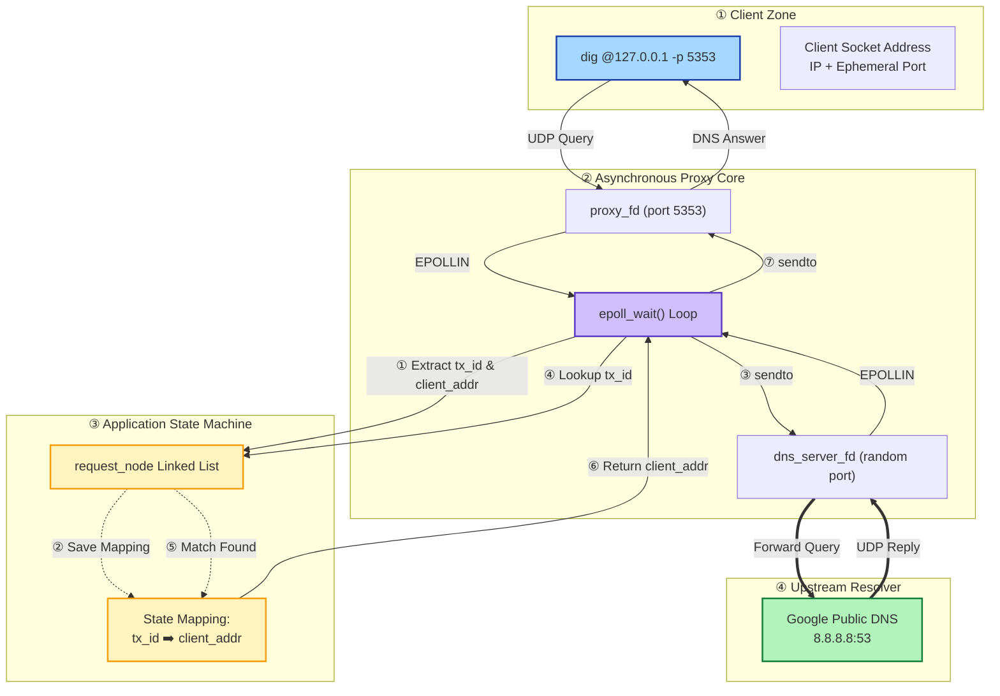
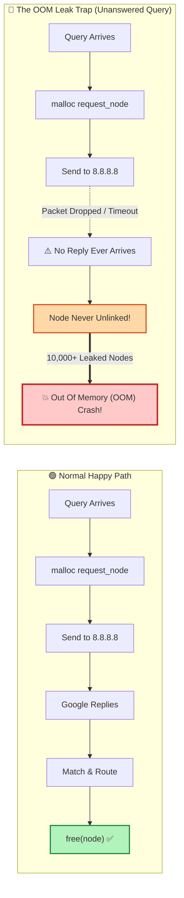

# 🧜‍♂️ Mermaid Visualizer: DNS Proxy Architecture & Flow

> **Built with Axton Liu's `mermaid-visualizer` skill specification.**  
> Optimized for Obsidian, GitHub, and FAANG technical presentations.

---

## 1️⃣ End-to-End Architecture (Swimlane Pattern)

---

## 2️⃣ Socket Multiplexing & Memory Leak Trap (Comparison Flow)

