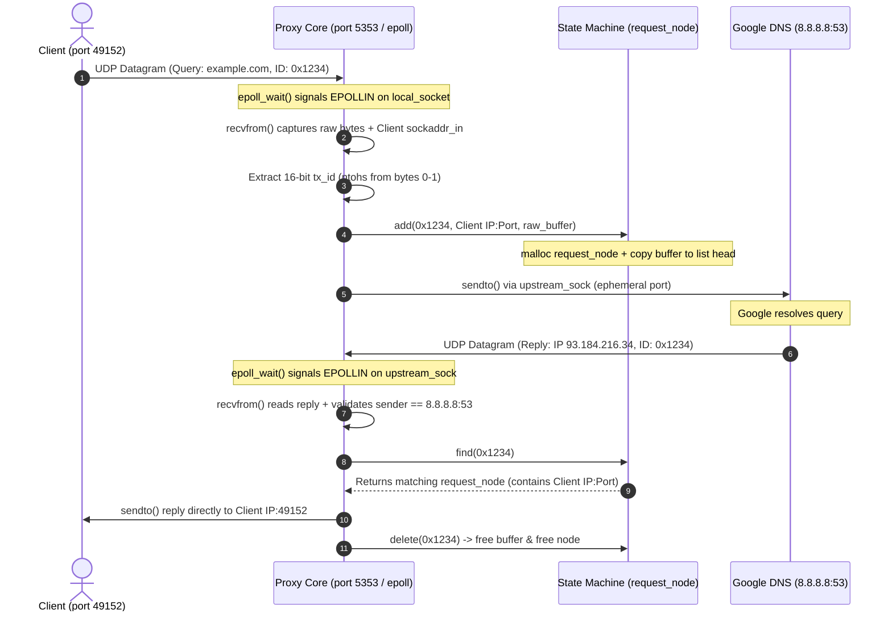

# Level 1: Codebase Interview Dissection Methodology

> **Purpose:** Transform from a passive code reader into an engineering architect ready to defend, critique, and dissect the `dns-proxy-cache` system in a top-tier FAANG systems interview.
> **Methodology:** Applying the 5-Step Interview Dissection Framework to Level 1 (Architecture & Foundation).

---

## 1. Start with the Architecture, Not the Code

Diving straight into source files creates cognitive overload. In an interview, you must first establish the system boundaries, data flow, and design trade-offs.

### A. System Boundaries & Service Roles
Our system is split into distinct operational layers:
1. **Client Boundary:** Local applications or diagnostic tools (e.g., `dig @127.0.0.1 -p 5353`) sending standard UDP DNS queries.
2. **Userspace Asynchronous Proxy Core (`proxy.c` / M2):** A transparent, non-blocking UDP relay listening on `127.0.0.1:5353` and forwarding to Google Public DNS (`8.8.8.8:53`).
3. **Application-Layer State Machine (`request_node` List):** A dynamic heap-allocated singly-linked list bridging the gap between stateless UDP packets and stateful client sessions.
4. **Protocol Construction & Wire Engine (`dns_wire.c` / M1):** Byte-level DNS RFC 1035 packet builder and response parser used for standalone synchronous resolution.

### B. End-to-End Data Flow Tracing
When an interviewer asks: *"Trace a request through your proxy from inception to completion,"* deliver this precise narrative:

### C. Leadership & Design Rationales
* **Why separate M1 (`main.c`) from M2 (`proxy.c`)?**  
  *M1* is a synchronous, blocking single-shot resolver designed to master DNS wire-format byte encoding/decoding. *M2* is an asynchronous, multi-client event loop designed to master high-concurrency socket multiplexing.
* **Why does M2 completely bypass `dns_wire.c` at runtime?**  
  *Transparent Forwarding.* The proxy does not need to parse domain names or question classes to route a packet. It only extracts bytes 0–1 (the 16-bit transaction ID) to key its state machine. Bypassing deep parsing achieves zero-latency relaying.

---

## 2. Active Comprehension via the Feynman Method

To avoid the illusion of competence, we isolate the most critical mechanism in Level 1 and explain it without jargon.

### A. Concept Isolation: Why UDP Forces Userspace State Management
In TCP, when a server calls `accept()`, the operating system kernel creates a **new, dedicated file descriptor** for that specific client connection. When the server wants to reply, it simply writes to that dedicated socket, and the kernel automatically handles routing back to the client.

In UDP, **there are no connections at the kernel level.** Our proxy listens on a single shared file descriptor (`local_socket`). When 100 different clients send DNS queries to port 5353, they all arrive on that exact same file descriptor.

### B. The Feynman Explanation (Simple Terms)
Imagine our proxy is a receptionist at a busy office building:
1. When a client drops off a letter asking a question (DNS query), they write their home address on the envelope (`struct sockaddr_in`).
2. The receptionist needs to forward this letter to a specialist (Google DNS at `8.8.8.8`). But when the specialist writes back, they only send it to the receptionist's office desk (`upstream_sock`)—they have no idea who originally asked!
3. Therefore, before sending the letter to Google, our receptionist **must write down a note in a ledger (`request_node` linked list)**: *"Letter ID #1234 came from Bob at Apt 4B."*
4. When Google replies with answer #1234, the receptionist checks the ledger, finds Bob's address, mails him the answer, and erases the note from the ledger.

### C. Identifying & Crushing Technical Gaps
* **Gap Question:** *Why do we set our sockets to non-blocking mode (`O_NONBLOCK`) using `fcntl()`?*  
  **Feynman Answer:** If our receptionist blocked the door waiting for Bob to hand over a letter, they couldn't simultaneously check the mailbox for Google's replies! Non-blocking mode ensures that if no letters are waiting, the OS returns immediately with an `EAGAIN` signal instead of freezing the thread.
* **Gap Question:** *Why do we loop on `recvfrom()` until `EAGAIN`?*  
  **Feynman Answer:** Because `epoll` tells us *"there is mail in the mailbox,"* but there might be 5 letters stacked together. If we only read one letter and go back to sleep, the other 4 letters sit unread until another letter arrives!

---

## 3. Build a Knowledge Graph (STA Method)

To externalize the mental model and prepare for architectural debates, we map our codebase into a **Source-Topic-Argument (STA)** matrix.

| Source File / Module | Linked CS Topics | Engineering Decision & Argument |
|---|---|---|
| `proxy.c` (Lines 19-86) | `[[Memory Management]]` `[[Data Structures]]` `[[UDP Statelessness]]` | **Stateful Userspace Routing vs. Stateless Forwarding:** *Decision:* We implemented a heap-allocated singly-linked list (`request_node`) storing `client_addr` and a copy of the query buffer. *Argument:* Unlike stateless HTTP proxies or TCP gateways, UDP datagrams lack kernel session streams. Without storing application-layer state keyed by the 16-bit DNS transaction ID, return routing from upstream resolvers is mathematically impossible. |
| `proxy.c` (Lines 140-180) | `[[I/O Multiplexing]]` `[[Linux Syscalls]]` `[[Concurrency]]` | **Level-Triggered `epoll` vs. Edge-Triggered (`EPOLLET`) / Multi-threading:** *Decision:* We used a single-threaded, Level-Triggered `epoll` event loop (`EPOLLIN`) monitoring two non-blocking UDP sockets. *Argument:* Multi-threading introduces mutex lock contention on the shared linked list. Level-Triggered `epoll` guarantees that if our inner drain loop misses a datagram, the kernel will re-notify us on the next cycle, eliminating dropped packet bugs while maintaining thread safety. |
| `dns_wire.c` / `main.c` | `[[Network Protocols]]` `[[Byte Ordering]]` `[[RFC 1035]]` | **Transparent Forwarding (M2) vs. Deep Wire Parsing (M1):** *Decision:* `main.c` links and uses `dns_wire.c` to construct and parse DNS headers, but `proxy.c` completely bypasses wire parsing. *Argument:* In M1, we act as the client terminating the protocol. In M2, we act as an intermediary relay. Bypassing deep name decoding in M2 saves CPU cycles and avoids parsing vulnerabilities when relaying arbitrary DNS payloads. |
| `wsa_init_helper.c` | `[[Cross-Platform Dev]]` `[[GCC Attributes]]` `[[C Runtime]]` | **Automatic Constructor/Destructor Injection:** *Decision:* We used GCC `__attribute__((constructor))` and `((destructor))` to auto-initialize Winsock (`WSAStartup`) before `main()` executes. *Argument:* Prevents scattering OS-specific `#ifdef _WIN32` initialization boilerplates across core application logic, keeping business logic pure and portable. |

---

## 4. Anticipate "Why" and "What If" Questions (Interview Defense)

In a FAANG interview, the interviewer will intentionally stress-test your system to find its failure horizons. Here is how you defend and critique `dns-proxy-cache`:

### A. Scalability & Bottleneck Analysis
* **Interviewer:** *"What breaks if this proxy suddenly receives 10,000 queries per second?"*
* **Your Defense:** *"At 10,000 QPS, our first catastrophic bottleneck is the **O(N) linear scan in `find()` and `delete()`** across the singly-linked list. With an average upstream latency of 50ms, there will be ~500 concurrent pending nodes in the list at any given millisecond. Every incoming response from Google triggers a linear walk across 500 nodes, resulting in **5 million node comparisons per second**. This will exhaust CPU L1/L2 cache locality and lock the event loop."*
* **The Architecture Upgrade:** *"To fix this, I would replace the linked list with a **Direct-Indexed Array or Hash Table**. Since DNS transaction IDs are exactly 16 bits (0 to 65,535), we can allocate a static array of 65,536 pointers: `request_node *state_table[65536]`. This reduces lookup and deletion complexity from **O(N) to guaranteed O(1)** with zero hash collisions and instant memory indexing!"*

### B. Resource Constraints & The OOM Leak Trap
* **Interviewer:** *"How does your application behave under network packet loss or upstream timeouts?"*
* **Your Defense:** *"Currently, the system suffers from **The OOM Leak Trap (REVIEW-SEEDS #8)**. When a client sends a query, `add()` allocates memory on the heap for both the `request_node` and a copy of the payload buffer. If the UDP packet to Google is dropped on the wire, or if Google fails to respond, **that memory is never freed**."*
* **The Architecture Upgrade:** *"Because we have no eviction timer or TTL expiration sweep, unanswered queries accumulate indefinitely in the linked list until the process crashes from Out-Of-Memory (OOM). To remediate this, I would embed a `time_t timestamp` in each `request_node`. I would then utilize `epoll_wait`'s timeout parameter (setting it to 1000ms instead of `-1` infinite) to trigger a periodic background sweep that evicts and frees any node older than 5 seconds."*

### C. Technology Alternatives & Trade-Offs
* **Interviewer:** *"Why did you use `epoll` instead of `select()`, `poll()`, or modern `io_uring`?"*
* **Your Defense:** *"In M1 (`main.c`), I used `select()` because we only monitored a single socket descriptor synchronously—the O(N) bitmap copy overhead of `select()` is negligible for 1 FD. In M2 (`proxy.c`), we multiplex multiple sockets asynchronously. `select()` and `poll()` require copying the entire file descriptor set between userspace and kernel space on every single loop iteration. `epoll` creates a persistent kernel data structure (`epoll_create1`), allowing us to register sockets once (`epoll_ctl`) and receive O(1) readiness events via `epoll_wait`.*
* *While `io_uring` offers superior zero-copy asynchronous I/O via shared kernel/userspace ring buffers, `epoll` provides the optimal balance of POSIX compatibility, simplicity, and high performance for a UDP datagram proxy."*

---

## 5. Practice Top-Down Navigation

In a live coding or architecture interview, you must navigate the repository by structural logic rather than random text searches. Here is how you demonstrate codebase mastery:

### A. Bug Localization Scenario: "The Misrouted Packet Bug"
* **Scenario:** A user reports that Client A occasionally receives a DNS answer containing an IP address that was actually requested by Client B! Where is the bug?
* **Structural Navigation:** 
  1. We know packet routing happens when upstream replies arrive. We navigate directly to `proxy.c` -> `upstream_sock` event handling block (Lines 221–259).
  2. We look at how the target client is identified: `request_node *node = find(id);` (Line 250).
  3. We inspect `find()` (Lines 54–61) and see it performs a linear search matching **only `temp->ID == ID`**.
  4. **The Root Cause (REVIEW-SEEDS #1):** DNS Transaction IDs are only 16-bit random numbers generated by clients. If Client A and Client B coincidentally generate the exact same ID (`0xAAAA`), `add()` prepends both to the list. When Google replies, `find()` returns the **first matching node at the head of the list**, sending Client B's answer to Client A!
  5. **The Fix Location:** We must modify `add()`, `find()`, and `delete()` to key nodes by a compound tuple: `(Transaction ID + Client IP + Client Port)`, or implement **Transaction ID Remapping** before sending queries upstream.

### B. Feature Integration Scenario: "Adding M3 Cache Persistence"
* **Scenario:** Where would you integrate an in-memory TTL DNS cache into `proxy.c` without disrupting the async event loop?
* **Structural Navigation:**
  1. Caching must intercept queries **before** they are forwarded upstream. We navigate to `proxy.c` -> `local_socket` read loop (Lines 194–220).
  2. Immediately after reading the datagram via `recvfrom()` (Line 200) and validating its length, we insert our **Cache Lookup Seam**.
  3. We call a new function `cache_lookup(buffer, received_bytes, &cached_resp, &resp_len)`.
  4. **If Cache Hit:** We rewrite bytes 0–1 of `cached_resp` to match the client's current Transaction ID, call `sendto(local_socket, ..., &client_addr)` immediately, and `continue` to the next event! Zero upstream bandwidth used!
  5. **If Cache Miss:** We proceed with the existing `add()` and `sendto(upstream_sock)` logic.
  6. To populate the cache, we navigate to the `upstream_sock` read loop (Lines 221–259), intercept Google's reply right before `sendto(local_socket)` (Line 256), call `dns_wire.c` -> `pars_reply()` to extract the TTL, and store the payload in our cache table!

---

## 6. Level 1 Interview Readiness Checklist

Before moving to Level 2, verify you can verbally explain and defend these core truths without looking at notes:

- [ ] I can draw the 4-layer architecture diagram (Client, Proxy Core, State List, Upstream Resolver) from memory.
- [ ] I can explain why UDP requires application-layer session tracking (`request_node`) while TCP does not.
- [ ] I can explain the Feynman analogy of the office receptionist and the ledger.
- [ ] I can defend why `proxy.c` uses Level-Triggered `epoll` and non-blocking sockets.
- [ ] I can pinpoint the exact line numbers where the OOM Leak Trap and 16-bit ID Collision bugs live.
- [ ] I can explain how to scale the proxy from O(N) linked list lookups to O(1) hash table lookups.
