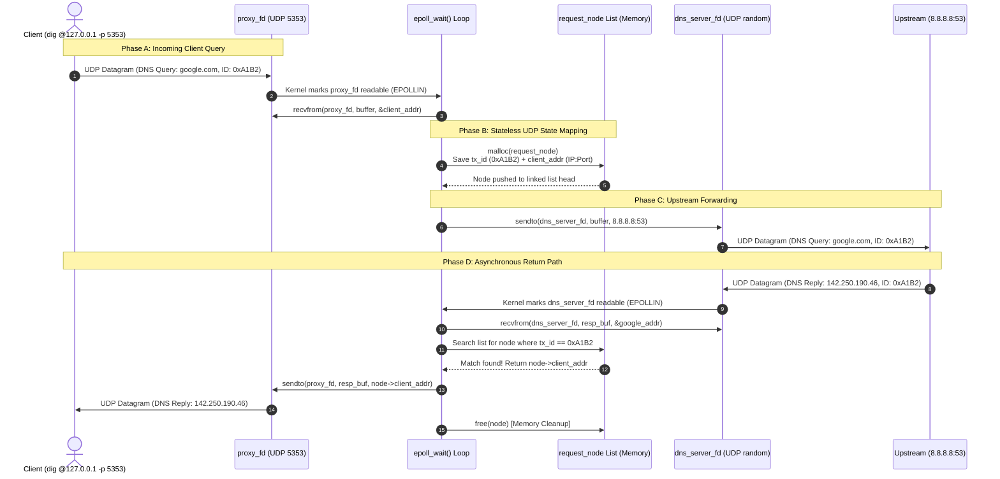

# Level 1 — Question 1: Client Query Lifecycle & Stateless UDP Mapping

> **Phase 1: Known Knowns (Memory Refresh & Baseline Verification)**  
> **Topic:** Asynchronous Socket Multiplexing, UDP Stateless Routing, and Application-Layer State Machines.  
> **Target Codebase:** `D:\clion\dns-proxy-cache\proxy.c` (Milestone 2)

---

## 📌 1. Executive Summary (The FAANG 30-Second Pitch)

When an asynchronous UDP DNS proxy receives a client query, it operates as a **stateful middleman bridging two stateless datagram streams**. 

Because UDP has no kernel-level connection state (unlike TCP streams), the OS kernel cannot automatically route an upstream response from Google Public DNS (`8.8.8.8`) back to the originating client. Therefore, when `epoll_wait()` wakes up on our client-facing socket (`proxy_fd`), our application must:
1. Read the datagram and capture the client's `sockaddr_in` (IP and ephemeral port).
2. Extract the 16-bit DNS Transaction ID from the packet header.
3. Allocate and store an application-layer state mapping (`tx_id ➡️ client_addr`) in a linked list (`request_node`).
4. Forward the query upstream via our server-facing socket (`dns_server_fd`).

When Google replies later on `dns_server_fd`, we use the returning Transaction ID to query our linked list, recover the original client's address, forward the DNS response back to them, and free the memory state.

---

## 🗺️ 2. Visual Architecture & Packet Flow Diagrams

### A. End-to-End Sequence Diagram (The Packet Lifecycle)



---

### B. Socket Multiplexing Flowchart (`epoll` Decision Tree)

```mermaid
flowchart TD
    Start([epoll_wait triggers with n_fds > 0]) --> Loop[Loop i = 0 to n_fds - 1]
    Loop --> CheckFD{events[i].data.fd == ?}
    
    CheckFD -->|proxy_fd<br/>Client Socket| CaseA[🟢 Case A: Client Query Arrived]
    CheckFD -->|dns_server_fd<br/>Upstream Socket| CaseB[🔵 Case B: Upstream Reply Arrived]
    CheckFD -->|Other / Error| CaseC[🔴 Error / EPOLLERR / EPOLLHUP]

    subgraph ClientPath [Client Query Processing]
        CaseA --> RecvClient[1. recvfrom proxy_fd<br/>Capture client_addr & payload]
        RecvClient --> ParseID[2. Extract DNS tx_id<br/>ntohs uint16_t at buffer 0 ]
        ParseID --> MallocState[3. malloc request_node<br/>Store tx_id, client_addr, timestamp]
        MallocState --> PushList[4. Push to request_list_head]
        PushList --> SendUpstream[5. sendto dns_server_fd<br/>Forward exact bytes to 8.8.8.8:53]
    end

    subgraph UpstreamPath [Upstream Reply Processing]
        CaseB --> RecvUpstream[1. recvfrom dns_server_fd<br/>Read DNS reply from 8.8.8.8]
        RecvUpstream --> ParseReplyID[2. Extract reply tx_id<br/>ntohs uint16_t at resp_buf 0 ]
        ParseReplyID --> SearchList[3. Walk request_list_head<br/>Find node where tx_id == reply tx_id]
        SearchList --> Found{Match Found?}
        Found -->|YES| SendClient[4. sendto proxy_fd<br/>Send reply to node->client_addr]
        SendClient --> FreeNode[5. free node & remove from list]
        Found -->|NO / Stale| DropPacket[⚠️ Drop Packet<br/>Log Unmatched Transaction ID]
    end
```

---

## 🧠 3. Deep Technical Breakdown: The "Why" Behind the Design

### A. How Socket Multiplexing Works in `epoll`
In a multi-client server, we cannot call a blocking `recvfrom()` on a single socket because while we wait for a client to speak, an upstream DNS server might be sending us a reply (or vice versa). 

We solve this by registering both UDP sockets into Linux's `epoll` event notification facility:
1. **`proxy_fd`**: Bound to `127.0.0.1:5353`. This socket communicates *exclusively* with local clients.
2. **`dns_server_fd`**: Bound to `0.0.0.0:0` (ephemeral port assigned by OS). This socket communicates *exclusively* with upstream resolvers like `8.8.8.8:53`.

When we call `epoll_ctl(epoll_fd, EPOLL_CTL_ADD, fd, &ev)`, we pass an `epoll_event` structure where `ev.data.fd = fd`. When `epoll_wait()` wakes up, it populates an array of events. By inspecting `events[i].data.fd`, our event loop instantly routes execution to either client query handling or upstream response handling.

### B. The Stateless UDP Problem (Why TCP Proxies Don't Need This)
In a **TCP Proxy**, every client establishes a dedicated, connection-oriented socket stream. The OS kernel allocates a unique file descriptor and socket control block (TCB) for that connection. If Client A connects on FD 10 and Client B connects on FD 11, the kernel natively knows where to send replies.

In a **UDP Proxy**, there are **no connections**. 
* When Client A (`192.168.1.50:49152`) and Client B (`192.168.1.51:52100`) both send DNS queries to our `proxy_fd` (`port 5353`), they arrive as isolated datagrams.
* When we forward those queries to `8.8.8.8:53` out of our single `dns_server_fd`, the source IP/port on the outgoing packets is **our proxy's IP and our ephemeral port**.
* When Google replies to our `dns_server_fd`, the packet contains *Google's answer* and *our transaction ID*, but the kernel's UDP stack has **zero memory** of whether Client A or Client B originally initiated that request!

**Conclusion:** If we do not manually save the mapping between the **DNS Transaction ID** and the **Client Socket Address** in application memory before calling `sendto()` upstream, it is physically impossible to route returning DNS replies back to the correct client.

---

## 💻 4. Code Walkthrough (`proxy.c` Mapping)

Let's examine how our codebase implements this state machine in C:

### A. The State Structure (`struct request_node`)
```c
// From proxy.c: The linked list node preserving stateless UDP mapping
struct request_node {
    uint16_t tx_id;              // 16-bit DNS Transaction ID (Host Byte Order)
    struct sockaddr_in client_addr; // Client's full IP and Ephemeral Port
    time_t timestamp;            // Timestamp for timeout / eviction tracking
    struct request_node *next;   // Pointer to next node in linked list
};

struct request_node *request_list_head = NULL; // Global list head
```

### B. Capturing State & Forwarding Upstream
```c
// When events[i].data.fd == proxy_fd (Client Query Arrives)
struct sockaddr_in client_addr;
socklen_t addr_len = sizeof(client_addr);

// 1. Read datagram AND capture client's address/port
ssize_t bytes_read = recvfrom(proxy_fd, buffer, sizeof(buffer), 0,
                              (struct sockaddr*)&client_addr, &addr_len);

if (bytes_read > 0) {
    // 2. Extract 16-bit DNS Transaction ID from bytes 0-1 of wire format
    // ntohs() converts Network Byte Order (Big Endian) to Host Byte Order
    uint16_t tx_id = ntohs(*(uint16_t*)buffer);

    // 3. Allocate application state memory
    struct request_node *req = malloc(sizeof(struct request_node));
    req->tx_id = tx_id;
    req->client_addr = client_addr;
    req->timestamp = time(NULL);

    // 4. Insert at head of linked list (O(1) insertion)
    req->next = request_list_head;
    request_list_head = req;

    // 5. Forward raw DNS payload upstream to 8.8.8.8:53
    sendto(dns_server_fd, buffer, bytes_read, 0,
           (struct sockaddr*)&dns_server_addr, sizeof(dns_server_addr));
}
```

### C. Resolving State on Upstream Reply
```c
// When events[i].data.fd == dns_server_fd (Google Replies)
ssize_t bytes_read = recvfrom(dns_server_fd, buffer, sizeof(buffer), 0, NULL, NULL);

if (bytes_read > 0) {
    // 1. Extract returning Transaction ID
    uint16_t reply_id = ntohs(*(uint16_t*)buffer);

    // 2. Walk linked list to find matching client state
    struct request_node *curr = request_list_head;
    struct request_node *prev = NULL;

    while (curr != NULL) {
        if (curr->tx_id == reply_id) {
            // 3. MATCH FOUND! Route DNS reply back to original client
            sendto(proxy_fd, buffer, bytes_read, 0,
                   (struct sockaddr*)&curr->client_addr, sizeof(curr->client_addr));

            // 4. Unlink node from list
            if (prev == NULL) {
                request_list_head = curr->next;
            } else {
                prev->next = curr->next;
            }

            // 5. Free memory to prevent leaks!
            free(curr);
            break;
        }
        prev = curr;
        curr = curr->next;
    }
}
```

---

## 🎯 5. FAANG Interview Q&A & Meta-Coaching

### Q: "Why did you use a Linked List for `request_node` instead of an Hash Table or Array?"
* **How a Mid-Level Answers:** *"A linked list is easy to implement in C and lets us add nodes quickly using `malloc` without worrying about fixed array sizes."*
* **How a FAANG Senior Answers:** *"In Milestone 2, a singly linked list gives us **O(1) insertion time** at the head, which optimizes for the fast path of incoming queries. However, lookup and deletion upon receiving an upstream reply is **O(N)**, where N is the number of concurrent in-flight queries. For low traffic, cache locality and simplicity win. But at FAANG scale (10,000+ QPS), linear scanning degrades CPU performance and introduces latency spikes. In production or Milestone 3, I would migrate this to a **fixed-size bucketed Hash Table** or an **intrusive Red-Black Tree** keyed by `tx_id` to achieve **O(1) or O(log N) lookups** while bounding memory allocation."*

### Q: "What is the biggest architectural vulnerability in this specific C implementation?"
* **FAANG Senior Answer:** *"There are two critical vulnerabilities in this implementation:*
  1. **Unbounded Memory Leak via Unanswered Queries:** If an upstream UDP packet is lost (which is common in UDP) or Google never replies, `curr->tx_id == reply_id` never matches. The `request_node` is never unlinked or freed. Under a network brownout or DDoS attack, `request_list_head` will grow infinitely until the process triggers an Out-Of-Memory (OOM) crash. **Fix:** We must implement an active eviction timer in `epoll_wait` (or a background cleanup sweep) that walks the list and `free()`s nodes where `time(NULL) - req->timestamp > TIMEOUT_SEC`.
  2. **Transaction ID Collisions:** The DNS transaction ID is only 16 bits (65,536 possible values). If two independent clients generate a query with the exact same random ID within the same TTL window, our simple `curr->tx_id == reply_id` check will match the *first* node found, sending Client B's private DNS response to Client A! **Fix:** In Milestone 3, we must either rewrite the outgoing Transaction ID to a unique proxy-generated ID, or key our state table on `(tx_id + client_ip + client_port + question_hash)`."*

---

## 🔗 6. Cross-References & Study Navigation
* **Master Code Map:** [CODE_MAP.md](file:///D:/clion/dns-proxy-cache/docs/CODE_MAP.md)
* **Review Seeds (Vulnerabilities):** [REVIEW-SEEDS.md](file:///D:/clion/dns-proxy-cache/docs/REVIEW-SEEDS.md#L20-L45) *(See Seed 1: ID Collisions & Seed 8: Memory Leaks)*
* **Milestone Progress Tracker:** [PROGRESS.md](file:///D:/clion/dns-proxy-cache/docs/PROGRESS.md)
* **Obsidian Canvas Visualizer:** [L1_Q1_Packet_Lifecycle_Canvas.canvas](file:///D:/clion/dns-proxy-cache/docs/L1_Q1_Packet_Lifecycle_Canvas.canvas)
