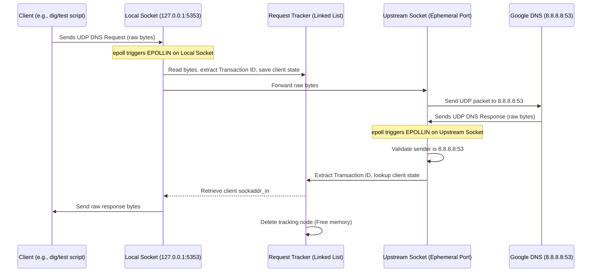

# DNS Proxy Cache Technical Documentation

This document describes the design, architecture, implementation details, and limitations of the **dns-proxy-cache** repository.

---

## 1. Overview
The **dns-proxy-cache** repository is a C11-based cross-platform DNS tool suite. It provides:
- **`dns_query` (M1):** A single-shot command-line DNS resolver that builds an A-record query, transmits it over UDP to an upstream server (`8.8.8.8`), and parses the IPv4 address from the response.
- **`dns_proxy` (M2):** A high-performance, asynchronous, epoll-based (Linux) UDP proxy server that listens locally on `127.0.0.1:5353`, forwards queries to `8.8.8.8:53`, and multiplexes responses back to their respective clients.

---

## 2. System Architecture & Data Flow

### Architectural Components
1. **Network Event Multiplexer (`proxy.c`):** Uses Linux `epoll` in non-blocking mode to monitor incoming queries on the local port and responses from the upstream DNS server. On Windows, this component executes a no-op fallback loop (`Sleep(1000)`).
2. **Transaction Tracker (`proxy.c`):** A singly linked list of request states, keyed by the 16-bit DNS Transaction ID. It holds the origin client's address, socket descriptor, and request payload to route the upstream's response back to the correct client.
3. **Wire Protocol Engine (`dns_wire.c`):** Encodes dotted hostnames into the standard DNS label format and parses A-record responses.

### Request-Response Data Flow (Mermaid Diagram)



---

## 3. Supported DNS Features

- **Query Type:** Hardcoded support for building and parsing **A records** (IPv4 addresses, QTYPE `0x0001`, QCLASS `0x0001`).
- **Protocols:** Strictly **UDP** transport. (No TCP, DoT, DoH, or DoQ).
- **EDNS0 Status:** Not supported. Maximum UDP buffer sizes are hardcoded to 1024 bytes (in `proxy.c`) or 512 bytes (in `dns_wire.c`), which complies with the standard 512-byte limit of original DNS (RFC 1035).
- **DNSSEC Status:** Not supported.
- **DNS Compression:** Compression pointers (`0xC0` prefix) are rejected with a parsing error if encountered in the question section label parsing. Compression in the answer section is not handled.

---

## 4. Build Configuration

The project utilizes CMake for compilation. 

### CMake Options
- `ENABLE_WARNINGS` (Default: `ON`): Enables strict compiler warnings.
  - MSVC: `/W4`
  - GCC/Clang: `-Wall -Wextra -Wpedantic -Wshadow -Wconversion`
- `ENABLE_PROXY_TARGET` (Default: `ON`): Controls whether the `dns_proxy` target is compiled.

### Compilation Commands
#### Command Line
```bash
# Generate build configuration
cmake -B build -DCMAKE_BUILD_TYPE=Debug

# Compile targets
cmake --build build
```

#### IDE (CLion / VS Code)
Open this folder as a project in CLion or VS Code (with CMake Tools). The IDE will automatically parse `CMakeLists.txt` and expose build/run targets for `dns_query` and `dns_proxy`.


---

## 5. Configuration Options

Currently, the configurations are **hardcoded in the source files** rather than using external files or arguments:

| Config Parameter | Type | Default Value | File & Location | Description |
| :--- | :--- | :--- | :--- | :--- |
| **Proxy Local IP** | String | `"127.0.0.1"` | `proxy.c` (line 107) | IP address on which the proxy binds to listen for client queries. |
| **Proxy Local Port** | Integer | `5353` | `proxy.c` (line 106) | UDP port on which the proxy binds. |
| **Upstream DNS IP** | String | `"8.8.8.8"` | `proxy.c` (line 132) | Upstream DNS server to forward queries to. |
| **Upstream DNS Port** | Integer | `53` | `proxy.c` (line 131) | Port of the upstream DNS server. |
| **Single-shot Domain** | String | `"example.com"` | `main.c` (line 33) | Domain queried by the single-shot `dns_query` executable. |

---

## 6. Usage Reference

### Running `dns_query` (Single-shot Resolver)
```bash
./build/dns_query
```
**Expected Output:**
```text
Resolved IP: 93.184.215.14
```

### Running `dns_proxy` (UDP Proxy Server)
On Linux/WSL:
```bash
# Run the proxy server (listens on 127.0.0.1:5353)
./build/dns_proxy
```

In a separate terminal, test the proxy using `dig`:
```bash
dig @127.0.0.1 -p 5353 google.com A
```

---

## 7. Codebase Module Reference

- **`main.c`:** Entry point for `dns_query`. Handles DNS packet construction, sending/receiving over UDP, and calling the response parsing function.
- **`proxy.c`:** Entry point for `dns_proxy`. Implements socket setup, non-blocking registration under `epoll`, the request state linked-list lookup (`add`, `find`, `delete`), and packet forwarding loops.
- **`dns_wire.c` / `dns_wire.h`:** Contains the wire encoding/decoding implementations.
  - `build_dns_query()`: Prepares the header and hostname bytes.
  - `pars_reply()`: Parses the first valid IPv4 response from an answer section.
- **`wsa_init_helper.c`:** Auto-initializes Winsock using GCC constructors before `main()` starts when compiled for Windows.
- **`patch.h`:** An experimental/testing header that wraps socket descriptors and redefines ports.

---

## 8. Testing

A Python test client is available to verify DNS query resolution through the proxy.

### Running Python Tests
Ensure the proxy is running (`./build/dns_proxy`), then run:
```bash
python dns_test.py
```
**Expected Output:**
```text
Sending DNS query to ('127.0.0.1', 5353)...
Received response from ('127.0.0.1', 5353): 12348180000100010000000006676f6f676c6503636f6d0000010001c00c00010001000000780004ad251a2e
Response Transaction ID: 1234
Resolved IP from response: 173.37.26.46
```

---

## 9. Security Considerations

- **Origin Server Verification:** `proxy.c` validates that any UDP packet received on `upstream_sock` originates strictly from the upstream address and port (`8.8.8.8:53`) to prevent IP spoofing or untrusted injection.
- **Malformed Packet Boundaries:** The proxy checks that any received packet is at least 2 bytes before extracting the Transaction ID, preventing out-of-bounds reads.
- **Vulnerabilities:**
  - **Transaction ID Collision:** The proxy tracks outstanding requests using a singly linked list keyed by a 16-bit Transaction ID. If multiple clients query the proxy with the same Transaction ID concurrently, the proxy will resolve only the first one or misroute replies.
  - **Amplification Attacks:** The proxy does not implement rate-limiting or verification of query volume, making it susceptible to UDP DNS amplification vectors if exposed to the open internet.

---

## 10. Known Limitations & Roadmap

- **Windows Compatibility:** `dns_proxy` lacks functional socket events on Windows natively, compiling into a no-op loop. WSL is required for local execution.
- **Single-threaded Linear Search:** Outstanding requests are managed in a singly linked list. As concurrent requests grow, lookups become $O(N)$ bottlenecks.
- **Roadmap:**
  - **Milestone 3 (TTL Cache):** Introduce an in-memory TTL-aware DNS cache (`dns_cache.c`) to minimize upstream queries and serve repeated domains locally.
  - **Milestone 4 (TCP Fallback):** Support TCP upstream fallback when a packet response is truncated (`TC` flag is set).
  - **Milestone 5 (Shutdown & Polish):** Add signal handling (`SIGINT`/`SIGTERM`) to gracefully close sockets and free list allocations.
